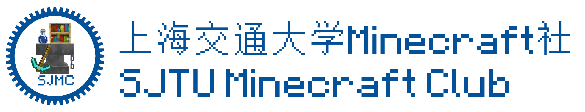

[](https://github.com/UNIkeEN/SJMCL/blob/main/.github/workflows/test.yml)


[](https://deepwiki.com/UNIkeEN/SJMCL)

[English](../README.md) · **简体中文**

## 功能特性

* **跨平台支持**：兼容 Windows 10/11、macOS 与 Linux。
* **高效的实例管理**：支持多个游戏目录与实例，集中管理所有实例资源（如存档、模组、资源包、光影包、截图等）与设置。
* **便捷的资源下载**：支持从 CurseForge 与 Modrinth 等源下载游戏客户端、Mod 加载器、各类游戏资源与整合包。
* **多账户系统支持**：内置 Microsoft 登录与第三方认证服务器支持，兼容 Yggdrasil Connect 的 OAuth 登录流程规范提案。
* **深度链接集成**：可与外部网站与工具集联动，支持通过系统深度链接、桌面快捷方式一键启动实例等便捷功能。

> 注意：部分功能可能受地区、运行平台或程序分发类型限制。

### 技术栈

[](https://tauri.app/)
[](https://nextjs.org/)
[](https://v2.chakra-ui.com/)

## 开始使用

开始使用 SJMCL，只需前往 [官网](https://mc.sjtu.cn/sjmcl/en) 下载最新版即可。

你也可以在 [GitHub Releases](https://github.com/UNIkeEN/SJMCL/releases) 获取所有版本，包括周期性构建。

SJMCL 目前支持以下平台：

| 平台    | 系统版本            | 架构               | 提供的的分发类型                              |
|---------|---------------------|--------------------|--------------------------------------------|
| Windows | 10 及以上           | `i686`, `x86_64`   | `.msi`，便携版 `.exe`                |
| macOS   | 10.15 及以上        | `aarch64`, `x86_64`| `.app`，`.dmg`                   |
| Linux   | webkit2gtk 4.1 (如 Ubuntu 22.04) | `x86_64` | `.AppImage`, `.deb`, `.rpm`, 便携版二进制文件 |

了解更多功能与常见问题，请参阅 [用户文档](https://mc.sjtu.cn/sjmcl/zh/docs)。

## 开发与贡献

首先克隆本项目并安装前端依赖：

```bash
git clone git@github.com:UNIkeEN/SJMCL.git
npm install
```

使用开发模式运行：

```bash
npm run tauri dev
```

我们热烈欢迎每一位开发者的贡献。

* 在开始前，请先阅读我们的 [贡献指南](https://github.com/UNIkeEN/SJMCL/blob/main/CONTRIBUTING.md)（内含开发流程详细说明）。
* API 参考与部分开发者笔记见 [开发者文档](https://mc.sjtu.cn/sjmcl/zh/dev)。
* 欢迎通过 [Pull Request](https://github.com/UNIkeEN/SJMCL/pulls) 或 [GitHub Issues](https://github.com/UNIkeEN/SJMCL/issues) 分享你的想法。

### 仓库活动

TBD <!-- TODO: https://repobeats.axiom.co -->

## 版权声明

版权所有 © 2024-2025 SJMCL 团队。

> 本软件并非官方 Minecraft 服务。未获得 Mojang 或 Microsoft 批准或关联许可。

本项目基于 [GNU 通用公共许可证 v3.0](../LICENSE) 发布。

依据 GPLv3 第 7 条款，当你分发本软件的修改版本时，除遵守 GPLv3 外，还须遵守以下 [附加条款](../LICENSE.EXTRA)：

1. 必须更换软件名称，禁止使用 SJMCL 或 SJMC Launcher；
2. 禁止移除向统计服务器发送信息的功能（`src-tauri/src/utils/sys_info.rs`），且仅发送带前缀（不少于两个字母，如 `XX-0.0.1`）的版本号；
3. 在你的仓库 README、分发网站或相关文档、软件的关于页面中，须明确标注你的程序基于 SJMCL，并注明原仓库链接。

<!-- TODO: FOSSA Here -->

## 社区合作伙伴

衷心感谢以下组织对 SJMCL 项目开发与社区的支持。

[
  <picture>
    <source srcset="figs/partners/sjmc-dark.png" media="(prefers-color-scheme: dark)">
    <source srcset="figs/partners/sjmc.png" media="(prefers-color-scheme: light)">
    
  </picture>
](https://mc.sjtu.cn)
&nbsp;&nbsp;
[](https://www.suesmc.ltd/)

[
  <picture>
    <source srcset="figs/partners/mua-dark.png" media="(prefers-color-scheme: dark)">
    <source srcset="figs/partners/mua.png" media="(prefers-color-scheme: light)">
    
  </picture>
](https://www.mualliance.cn)
&nbsp;&nbsp;&nbsp;&nbsp;
[
  <picture>
    <source srcset="figs/partners/gnwork-dark.png" media="(prefers-color-scheme: dark)">
    <source srcset="figs/partners/gnwork.png" media="(prefers-color-scheme: light)">
    
  </picture>
](https://space.bilibili.com/403097853)